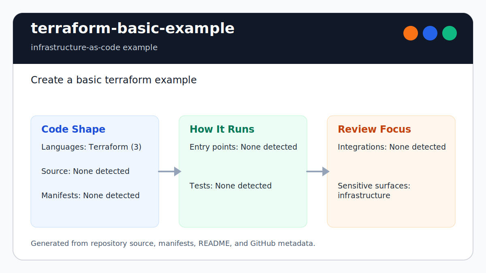

# terraform-basic-example

<!-- README-OVERVIEW-IMAGE -->


## Overview

`garethpaul/terraform-basic-example` is an infrastructure-as-code example. Create a basic terraform example

This README is based on the checked-in source, manifests, scripts, and repository metadata on the `master` branch. The project language mix found during review was: Terraform (3).

## Repository Contents

- `README.md` - project overview and local usage notes
- `CHANGES.md` - maintenance history for Terraform guardrails
- `.github/workflows/check.yml` - GitHub Actions baseline for `make check`
- `.terraform.lock.hcl` - reproducible AWS provider selection and checksums
- `Makefile` - local verification entry points
- `docs/plans` - completed maintenance plans for the current baseline
- `main.tf` - Terraform provider and resource configuration
- `outputs.tf` - Terraform outputs
- `plans` - historical implementation notes
- `scripts` - static Terraform hygiene and configuration validators
- `SECURITY.md` - security reporting and disclosure guidance
- `variables.tf` - validated Terraform input variables
- `VISION.md` - project direction and maintenance guardrails

Additional scan context:

- Source directories: no top-level source directories detected
- Dependency and build manifests: none detected
- Entry points or build surfaces: none detected
- Test-looking files: no obvious test files detected

## Getting Started

### Prerequisites

- Git
- Terraform 1.5 or newer in the 1.x release line
- Python 3 for static repository checks

### Setup

```bash
git clone https://github.com/garethpaul/terraform-basic-example.git
cd terraform-basic-example
terraform init
```

The setup commands above are derived from repository files. Legacy mobile, Python, or JavaScript samples may require older SDKs or package versions than a modern workstation uses by default.

## Running or Using the Project

- Use `terraform plan` after `terraform init` to inspect infrastructure changes before applying anything.
- Override `aws_region`, `ami_id`, and `instance_type` when planning outside
  the sample defaults; AMI IDs are region-specific and instance type changes
  can affect cost.
- Inbound HTTP is disabled by default. Set `allowed_cidr_blocks` explicitly to
  reviewed canonical IPv4 CIDRs when access is needed, preferably a narrow `/32`
  for the caller rather than `0.0.0.0/0`. For example, set
  `TF_VAR_allowed_cidr_blocks='["198.51.100.10/32"]'` before planning, replacing
  the reserved documentation address with the caller's public IP.

## Testing and Verification

- `make check` runs static Terraform hygiene/configuration checks. When
  `terraform` is installed, the `build` target also runs `terraform fmt
  -check -diff`, `terraform init -backend=false -lockfile=readonly`, and
  `terraform validate -no-color`, followed by mocked `terraform test
  -no-color` plans. The Makefile resolves paths from its own location, so the
  same check can be invoked from outside the repository.
- Native Terraform tests prove the default server port plans successfully and
  reject fractional port values before user data or security groups reach AWS.
- AMI ID length validation accepts only the legacy 8-character or current
  17-character lowercase hexadecimal EC2 identifier widths.
- Native Terraform tests use the mocked provider to prove the default creates
  no inbound HTTP rule, explicit canonical IPv4 CIDRs opt in to one rule, and
  malformed, IPv6, or host-bit-bearing ranges are rejected before they can
  reach the security group's IPv4-only `cidr_blocks` field.
- Static checks require configurable region, AMI, instance type, ingress CIDR
  syntax, and server port validation instead of editing literals in `main.tf`.
  Instance type validation requires EC2-shaped values such as `t2.micro`.
  Static checks also require the EC2 instance metadata service to use IMDSv2
  tokens and a one-hop metadata response limit, the root block device to be
  encrypted, and user-data edits to replace the demo instance. Security group
  checks require descriptions and a `Name` tag so AWS plans show the rule
  intent. Resource checks also require shared ownership tags to be merged into
  the EC2 instance and security group.
- Hygiene checks also require completed canonical plans under `docs/plans`.
- GitHub Actions runs the same `make check` baseline on pushes and pull
  requests with Terraform 1.15.6, so formatting, provider initialization, and
  configuration validation are required in CI. The workflow uses read-only
  repository permissions, disabled checkout credential persistence, a fixed
  Ubuntu 24.04 image, a ten-minute timeout, concurrency cancellation, and
  commit-pinned Node 24 actions.
- `main.tf` constrains Terraform to supported 1.x releases and the AWS provider
  to 6.x. The validation gate treats `.terraform.lock.hcl` as read-only and
  currently requires the reviewed AWS provider 6.49.0 selection and registry
  checksums. Update the lockfile and static contract together when changing
  provider versions.

When the required SDK or runtime is unavailable, use static checks and source review first, then verify on a machine that has the matching platform toolchain.

## Configuration and Secrets

- No required secret or credential file was identified in the repository scan. If you add integrations later, keep secrets out of git.

## Security and Privacy Notes

- Review changes touching infrastructure, proxy, cloud, or deployment configuration; examples from the scan include main.tf.

## Maintenance Notes

- See `SECURITY.md` for vulnerability reporting and safe research guidance.
- See `VISION.md` for project direction and contribution guardrails.
- See `docs/plans/2026-06-08-terraform-basic-example-baseline.md` for the
  canonical Terraform hygiene and configuration baseline.
- See `docs/plans/2026-06-08-cidr-validation.md` for ingress CIDR validation
  coverage.
- See `docs/plans/2026-06-08-imdsv2-required.md` for the EC2 metadata token
  guard.
- See `docs/plans/2026-06-09-metadata-hop-limit.md` for the EC2 metadata hop
  limit guard.
- See `docs/plans/2026-06-09-root-volume-encryption.md` for the root volume
  encryption guard.
- See `docs/plans/2026-06-09-configurable-instance-type.md` for the EC2
  instance type variable guard.
- See `docs/plans/2026-06-09-instance-type-syntax.md` for the EC2 instance type
  syntax validation guard.
- See `docs/plans/2026-06-09-user-data-replacement.md` for the EC2 user-data
  replacement guard.
- See `docs/plans/2026-06-09-security-group-metadata.md` for the security group
  description and tag guard.
- See `docs/plans/2026-06-09-resource-tags.md` for the shared resource
  ownership tag guard.
- See `docs/plans/2026-06-10-ci-baseline.md` for the reproducible Terraform
  validation gate.
- See `docs/plans/2026-06-10-readonly-provider-lock.md` for immutable provider
  lock enforcement.
- See `docs/plans/2026-06-10-server-port-integer-test.md` for whole-number port
  validation and the mocked Terraform plan test.
- See `docs/plans/2026-06-12-resource-tags-validation.md` for common tag input
  validation and mocked Terraform rejection tests.
- See `docs/plans/2026-06-12-ipv4-ingress-cidrs.md` for the ingress address-
  family boundary and mocked IPv6 rejection test.
- See `docs/plans/2026-06-13-private-ingress-default.md` for the opt-in HTTP
  ingress default and mocked rule-creation tests.
- See `docs/plans/2026-06-13-canonical-ipv4-ingress-cidrs.md` for canonical
  IPv4 CIDR validation before provider execution.
- See `docs/plans/2026-06-14-make-root-override-protection.md` for authoritative
  repository-root selection across all Make aliases.
- See `docs/plans/2026-06-14-ami-id-length-validation.md` for mocked plan
  coverage of accepted and structurally invalid EC2 image identifiers.

## Contributing

Keep changes small and tied to the project that is already present in this repository. For code changes, document the toolchain used, avoid committing generated dependency directories or local configuration, and update this README when setup or verification steps change.
